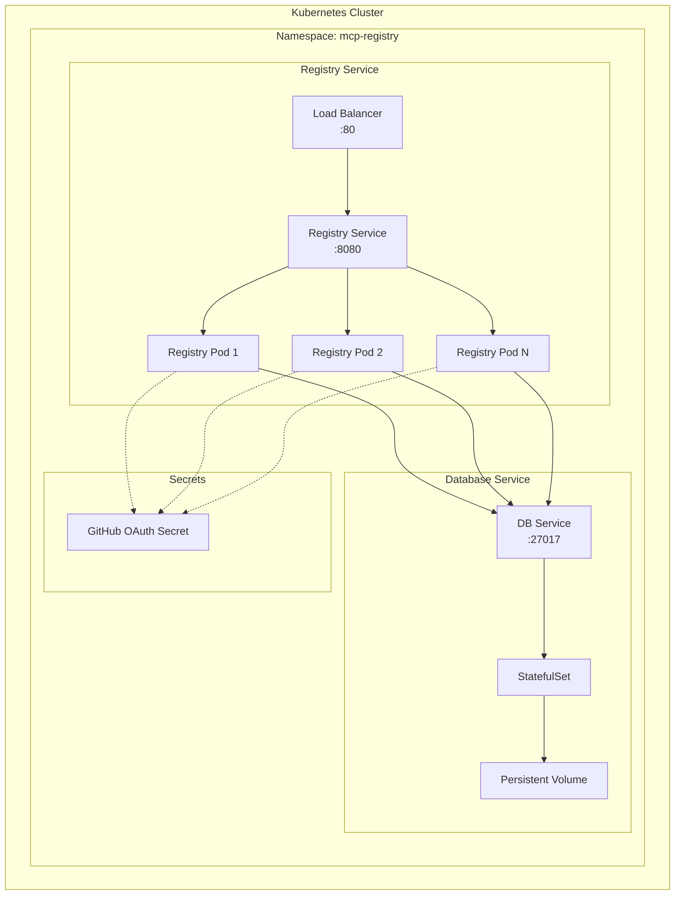
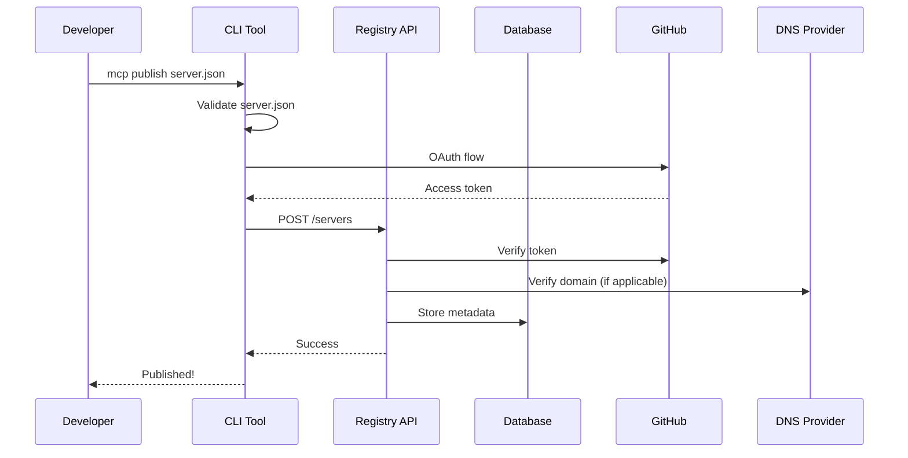
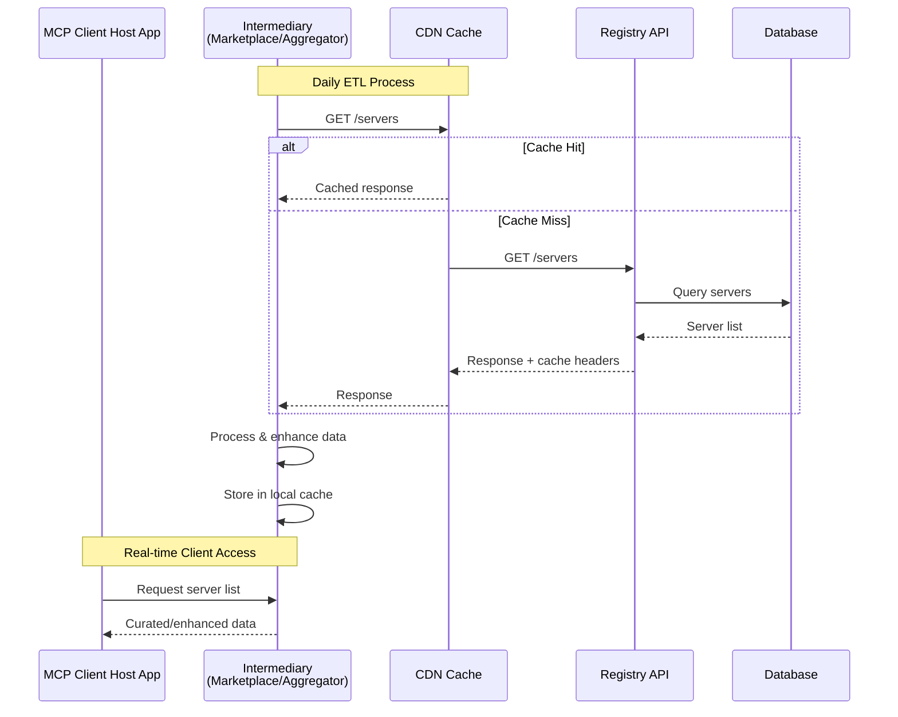
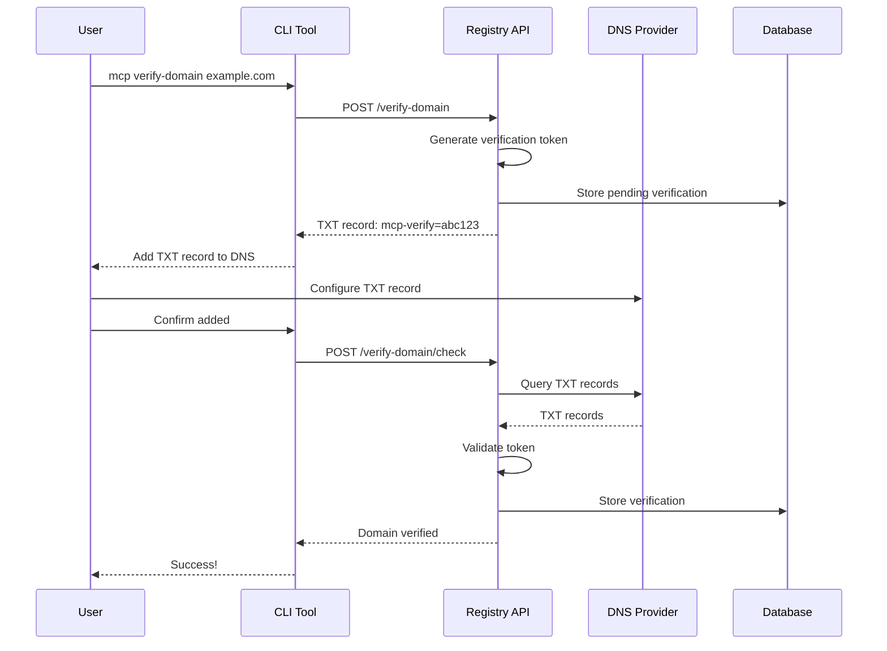
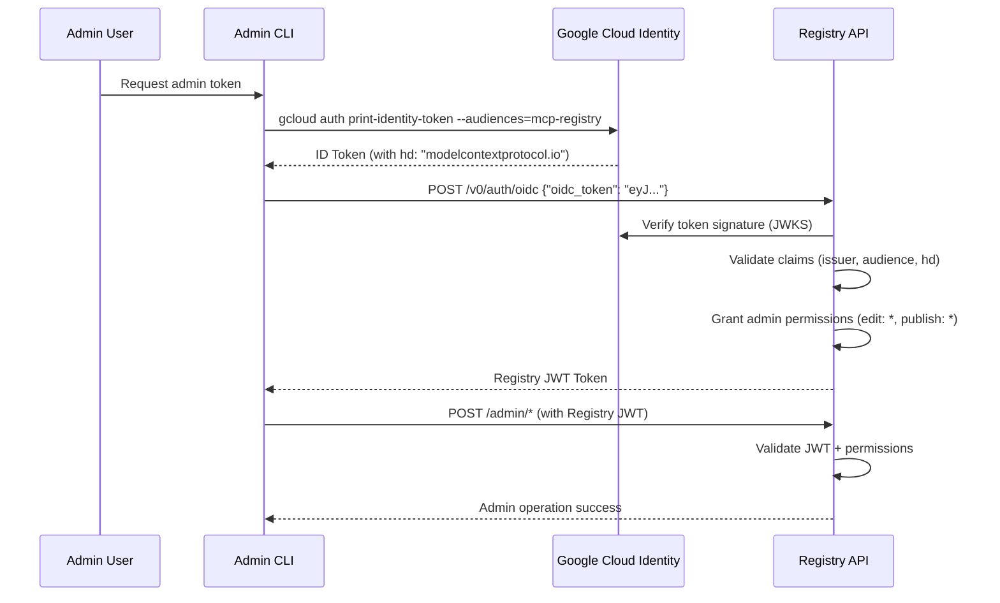

# Complete Documentation

This file contains all documentation from the docs/ directory compiled into a single markdown file.

---

## File: docs/README.md

# MCP Registry Documentation

The MCP registry provides MCP clients with a list of MCP servers, like an app store for MCP servers.

## I want to...

- **📤 Publish my MCP server** → [Publishing Guide](guides/publishing/publish-server.md)
- **📥 Consume registry data** → [API Usage Guide](guides/consuming/use-rest-api.md)
- **🔌 Understand the registry's purpose** → [Ecosystem vision](explanations/ecosystem-vision.md)
- **📋 Look up specific information** → [server.json spec](reference/server-json/generic-server-json.md) | [API spec](reference/api/generic-registry-api.md) | [CLI reference](reference/cli/commands.md)

## Documentation Index

- 🛠️ [How-To Guides: Task-focused instructions](./guides/)
- 💡 [Explanations: Understanding-oriented content](./explanations/)
- 📖 [Reference: Technical specifications and lookup material](./reference/)

---

## File: docs/explanations/README.md

# Explanations

Understanding-oriented documentation that clarifies and illuminates the MCP Registry.

- [Design principles](design-principles.md)
- [Ecosystem vision](ecosystem-vision.md)
- [Roadmap](roadmap.md)
- [Tech architecture](tech-architecture.md)
- [Namespacing](namespacing.md)
- [Versioning](versioning.md)

---

## File: docs/explanations/design-principles.md

# MCP Registry Design Principles

These are the core constraints that guide the design of the MCP Registry. They are not exhaustive, but they are the most important principles that we will use to evaluate design decisions.

## 1. Single Source of Truth

The registry serves as the authoritative metadata repository for publicly-available MCP servers, both locally-run and remote, open source and closed source. Server creators publish once, and all consumers (MCP clients, aggregators, etc.) reference the same canonical data.

## 2. Minimal Operational Burden

- Design for low maintenance and operational overhead
- Delegate complexity to existing services where possible (GitHub for auth, npm/PyPI/NuGet for packages)
- Avoid features that require constant human intervention or moderation
- Build for reasonable downtime tolerance (24h acceptable) by having consumers cache data for their end-users

## 3. Vendor Neutrality

- No preferential treatment for specific servers or organizations
- No built-in ranking, curation, or quality judgments
- Let consumers (MCP clients, aggregators) make their own curation decisions

## 4. Meets Industry Security Standards

- Leverage existing package registries (npm, PyPI, NuGet, Docker Hub, etc.) for source code distribution, obviating the need to reinvent source code security
- Use mechanisms like DNS verification, OAuth to provide base layer of authentication and trust
- Implement rate limiting, field validation, and blacklisting to prevent abuse

## 6. Reusable, Extensible Shapes; Not Infrastructure

- API shapes (OpenAPI, server.json) designed for reuse
- Enable private/internal registries using same formats
- Don't mandate infrastructure reuse - focus on interface compatibility

## 7. Progressive Enhancement

- Start with MVP that provides immediate value
- Build foundation that supports future features
- Don't over-engineer for hypothetical needs
- Each milestone should be independently valuable

---

## File: docs/explanations/ecosystem-vision.md

# Ecosystem Vision

How the MCP Registry fits into the broader ecosystem and our vision for the future.

## The Registry Ecosystem

The MCP registry provides MCP clients with a list of MCP servers, like an app store for MCP servers. (In the future it might do more, like also hosting a list of clients).

There are two parts to the registry project:

1. 🟦 **The MCP registry spec**: An [API specification](../reference/api/) that allows anyone to implement a registry.
2. 🟥 **The Official MCP registry**: A hosted registry following the MCP registry spec at [`registry.modelcontextprotocol.io`](https://registry.modelcontextprotocol.io). This serves as the **authoritative repository** for publicly-available MCP servers. Server creators publish once, and all consumers (MCP clients, aggregators, marketplaces) reference the same canonical data. This is owned by the MCP open-source community, backed by major trusted contributors to the MCP ecosystem such as Anthropic, GitHub, PulseMCP and Microsoft.

The registry is built around the [`server.json`](../reference/server-json/) format - a standardized way to describe MCP servers that works across discovery, initialization, and packaging scenarios.

In time, we expect the ecosystem to look a bit like this:


Note that MCP registries are _metaregistries_. They host metadata about packages, but not the package code or binaries. Instead, they reference other package registries (like NPM, PyPi or Docker) for this.

Additionally, we expect clients pull from _subregistries_. These subregistries add value to the registry ecosystem by providing curation, or extending it with additional metadata. The Official MCP registry expects a lot of API requests from ETL jobs from these subregistries.

## Registry vs Package Registry

Key distinction: MCP Registries are **metaregistries**.

- **Package registries** (npm, PyPI, Docker Hub) host actual code/binaries
- **The MCP Registry** hosts metadata pointing to those packages

```
MCP Registry: "weather-server v1.2.0 is at npm:weather-mcp"
NPM Registry: [actual weather-mcp package code]
```

## Official vs Community Registries

**Official MCP Registry** (`registry.modelcontextprotocol.io`):
- Canonical source for publicly-available servers
- Community-owned, backed by trusted contributors
- Focuses on discoverability and basic metadata

**Subregistries** (Smithery, PulseMCP, etc.):
- Add value through curation, ratings, enhanced metadata
- ETL from official registry + additional annotations
- Serve specific communities or use cases

## How Servers Are Represented

Each server entry contains:
- **Identity**: Unique name (`io.github.user/server-name`)
- **Packages**: Where to download it (`npm`, `pypi`, `docker`, etc.)
- **Runtime**: How to execute it (args, env vars)
- **Metadata**: Description, capabilities, version

This is stored in a standardized `server.json` format that works across discovery, installation, and execution.

---

## File: docs/explanations/roadmap.md

# MCP Registry Roadmap

This is a high-level roadmap for the MCP Registry. It is subject to change and not exhaustive, but it outlines the general thinking of the sequencing and scope of our work in this repository.

This roadmap may occasionally drift out of date. Please review [Issues](https://github.com/modelcontextprotocol/registry/issues) (and corresponding Labels) for the most current work in progress.

## Current Status

The initial version of the MCP Registry is actively being developed. The initial focus is on delivering a REST API to which server creators can publish, and aggregator/marketplace consumers can ETL.

## Phase 1: MVP/Go-Live (Current Focus)

See the [go-live blocker issues](https://github.com/modelcontextprotocol/registry/issues?q=is%3Aissue%20state%3Aopen%20label%3A%22go-live%20blocker%22).

## Backlog (Future Work, may be moved to out of scope)

- [ ] UI implementation
- [ ] Store and surface other data besides servers (e.g. [clients](https://modelcontextprotocol.io/clients), resources)
- [ ] Download count tracking
- [ ] Internationalization (i18n)

## Out of Scope (Not Planned)

- **Source code hosting**: The registry will never host actual server code
- **Quality rankings**: No built-in server quality assessments or rankings
- **Curation**: No editorial decisions about which servers are "better"
- **Unified runtime**: Not solving how servers are executed
- **Server hosting**: The registry does not provide hosting for servers
- **Search engine**: The registry will not provide a commercial grade search engine for servers
- **Server tags or categories**: Not supported, to reduce moderation burden
- **Server rankings**: The registry will not rank servers by subjective measures of quality

---

## File: docs/explanations/tech-architecture.md

# MCP Registry Technical Architecture

This document describes the technical architecture of the MCP Registry, including system components, deployment strategies, and data flows.

## System Overview

The MCP Registry is designed as a lightweight metadata service that bridges MCP server creators with consumers (MCP clients and aggregators).

## Core Components

### REST API (Go)

The main application server implemented in Go, providing:
- Public read endpoints for server discovery
- Authenticated write endpoints for server publication
- GitHub OAuth integration (extensible to other providers)
- DNS verification system (optional for custom namespaces)

### Database (PostgreSQL)

Primary data store for:
- Versioned server metadata (server.json contents)
- User authentication state
- DNS verification records

### CDN Layer

Critical for scalability:
- Caches all public read endpoints
- Reduces load on origin servers
- Enables global distribution
- Designed for daily consumer polling patterns

### CLI Tool

Developer interface for:
- Server publication workflow
- GitHub OAuth flow
- DNS verification

## Deployment Architecture

### Kubernetes Deployment (Helm)

The registry is designed to run on Kubernetes using Helm charts:



## Data Flow Patterns

### 1. Server Publication Flow



### 2. Consumer Discovery Flow



### 3. DNS Verification Flow



### 4. Admin OIDC Authentication Flow

For registry administration, users with @modelcontextprotocol.io Google Cloud Identity accounts can authenticate using OIDC:



**Usage:**
```bash
# Get Google Cloud Identity token
ID_TOKEN=$(gcloud auth print-identity-token)

# Exchange for Registry JWT token
REGISTRY_TOKEN=$(curl -X POST /v0/auth/oidc \
  -H "Content-Type: application/json" \
  -d '{"oidc_token": "'$ID_TOKEN'"}' | jq -r .registry_token)

# Use for admin operations
curl -H "Authorization: Bearer $REGISTRY_TOKEN" /v0/...
```

---

## File: docs/guides/README.md

# How-To Guides

Problem-oriented guides for specific tasks with the MCP Registry.

## Publishing Servers

- [Publish a server](publishing/publish-server.md)
- [GitHub Actions](publishing/github-actions.md)

## Consuming Registry Data

- [Use the REST API](consuming/use-rest-api.md)

## Contributing

- [Add package registry](contributing/add-package-registry.md)

## Administration

- [Admin operations](administration/admin-operations.md)
- [Moderation guidelines](administration/moderation-guidelines.md)

---

## File: docs/guides/administration/admin-operations.md

# Admin Operations

This is a brief guide for admins and moderators managing content on the registry. All actions should be taken in line with the [moderation guidelines](moderation-guidelines.md).

## Prerequisites

- Admin account with @modelcontextprotocol.io email
  - If you are a maintainer and would like an account, ask in the Discord
- `gcloud` CLI installed and configured
- `curl` and `jq` installed

## Authentication

```bash
# Run this, then run the export command it outputs
./tools/admin/auth.sh
```

## Edit a Server

Step 1: Download Server

```bash
export SERVER_ID="<server-uuid>"
curl -s "https://registry.modelcontextprotocol.io/v0/servers/${SERVER_ID}" > server.json
```

Step 2: Open `server.json` and make changes. You cannot change the server name.

Step 3: Push Changes

```bash
curl -X PUT "https://registry.modelcontextprotocol.io/v0/servers/${SERVER_ID}" \
  -H "Authorization: Bearer ${REGISTRY_TOKEN}" \
  -H "Content-Type: application/json" \
  -d "{\"server\": $(cat server.json)}"
```

## Takedown a Server

```bash
export SERVER_ID="<server-uuid>"
./tools/admin/takedown.sh
```

This soft deletes the server. If you need to delete the content of a server (usually only where legally necessary), use the edit workflow above to scrub it all.

---

## File: docs/guides/administration/moderation-guidelines.md

# Moderation Guidelines

Guidelines for server publishers on the Official MCP Registry.

## TL;DR

We're quite permissive! We only remove illegal content, malware, spam and completely broken servers.

We don't make guarantees about our moderation, and subregistries should take our data "as is", assuming minimal to no moderation.

## Scope

These guidelines apply to the **Official MCP Registry** at `registry.modelcontextprotocol.io`.

Subregistries may have their own moderation policies. If you have questions about content on a specific subregistry, please contact them directly.

## Disclaimer

We have limited active moderation capabilities, and this is a community supported projects. We largely rely on upstream package registries (like NPM, PyPi, and Docker) or downstream subregistries (like the GitHub MCP Registry) to do more in-depth moderation.

This means there may be content in the registry that should be removed under these guidelines, which we haven't yet removed. You should treat registry data accordingly.

## What We Remove

We'll remove servers that contain:

- Illegal content, which includes obscene content, copyright violations, and hacking tools
- Malware, regardless of intentions
- Spam, especially mass-created servers that disrupt the registry. Examples:
    - The same server being submitted multiple times under different names.
    - The server doesn't do anything but provide a fixed response with some marketing copy.
    - The server description is stuffed with marketing copy, and its implementation is unrelated to its name or description.
- Non-functioning servers

## What We Don't Remove

Generally, we believe in keeping the registry open and pushing moderation to subregistries. We therefore **won't** remove servers that are:

- Low quality or buggy servers
- Servers with security vulnerabilities
- Do the same thing as other servers
- Provide or contain adult content

## How Removal Works

When we remove a server:

- It's set to "deleted" status but remains accessible via the API
- This allows subregistries to remove it from their indexes
- In extreme cases, we may overwrite or erase details of a server, e.g. where the metadata itself is unlawful

## Appeals

Think we made a mistake? Open an issue on our [GitHub repository](https://github.com/modelcontextprotocol/registry) with:
- The ID and name of your server
- Why you believe it doesn't meet the criteria for removal above

## Changes to this policy

We're still learning how to best run the MCP registry! As such, we might end up changing this policy in the future.

---

## File: docs/guides/contributing/add-package-registry.md

# Adding a new package registry

The MCP Registry project is a **metaregistry**, meaning that it hosts metadata for MCP servers but does not host the code for the servers directly.

For local MCP servers, the MCP Registry has pointers in the `packages` node of the [`server.json`](../../reference/server-json/generic-server-json.md) schema that refer to packages in supported package managers.

The list of supported package managers for hosting MCP servers is defined by the `properties.packages[N].properties.registry_type` string enum in the [`server.json` schema](../../reference/server-json/server.schema.json). For example, this could be "npm" (for npmjs.com packages) or "pypi" (for PyPI packages).

For remote MCP servers, the package registry is not relevant. The MCP client consumes the server via a URL instead of by downloading and running a package. In other words, this document only applies to local MCP servers.

For the sake of illustration, this document will use npm (the Node.js package manager) as an example at each step.

## Prerequisites

The package registry must meet the following requirements:

1. The package registry supports packaging and executing CLI apps. Local MCP servers use the [stdio transport](https://modelcontextprotocol.io/docs/concepts/transports#standard-input%2Foutput-stdio).
   - npm CLI tools typically express their CLI commands in the [`bin` property of the package.json](https://docs.npmjs.com/cli/v11/configuring-npm/package-json#bin)
1. The package registry (or associated client tooling) has a widely accepted **single-shot** CLI command.
   - npm's `npx` tool executes CLI commands using a [documented execution heuristic](https://docs.npmjs.com/cli/v11/commands/npx#description)
   - For example, the MCP client can map the `server.json` metadata to an `npx` CLI execution, with args and environment variables populated via user input.
1. The package registry supports anonymous package downloads. This allows the MCP client software to use the metadata found in the MCP registry to discover, download, and execute package-based local MCP servers with minimal user intervention.
   - `npx` by default connects to the public npmjs.com registry, allowing simple consumption of public npm packages.
1. The package registry should support a validation mechanism to verify ownership of the server name. This prevents misattribution and ensures that only the actual package owner can reference their packages in server registrations. For example:
   - npm requires an `mcpName` field in `package.json` that matches the server name being registered
   - PyPI requires a `mcp-name:` line in the package README/description
   - Each registry type must implement a validation mechanism accessible via public API

## Steps

These steps may evolve as additional validations or details are discovered and mandated.

1. [Create a feature request issue](https://github.com/modelcontextprotocol/registry/issues/new?template=feature_request.md) on the MCP Registry repository to begin the discussion about adding the package registry.
   - Example for NuGet: https://github.com/modelcontextprotocol/registry/issues/126
1. Open a PR with the following changes:
   - Update the [`server.json` schema](../../reference/server-json/server.schema.json)
     - Add your package registry name to the `registry_type` example array.
     - Add your package registry base url to the `registry_base_url` example array.
     - Add the single-shot CLI command name to the `runtime_hint` example value array.
   - Update the [`openapi.yaml`](../../reference/api/openapi.yaml)
     - Add your package registry name to the `registry_type` enum value array.
     - Add your package registry base url to the `registry_base_url` enum value array.
     - Add the single-shot CLI command name to the `runtime_hint` example value array.
   - Add a sample, minimal `server.json` to the [`server.json` examples](../../reference/server-json/generic-server-json.md).
   - Implement a registry validator:
      - Create a new validator file: `internal/validators/registries/yourregistry.go`, following the pattern of existing validators. Examples:
         - **npm**: Checks for an `mcpName` field in `package.json` that matches the server name
         - **PyPI**: Searches for `mcp-name: server-name` format in the package README content
         - **NuGet**: Looks for `mcp-name: server-name` format in the package README file
         - **Docker/OCI**: Validates a Docker image label `io.modelcontextprotocol.server.name` in the image manifest
      - Add corresponding unit tests: `internal/validators/registries/yourregistry_test.go`
      - Register your validator in `internal/validators/validators.go`
   - Update the publishing documentation:
      - Add a new publishing guide: `docs/guides/publishing/publish-[yourregistry].md`, following the pattern of existing publishing guides (e.g., `publish-npm.md`, `publish-pypi.md`)
      - Include instructions on how to prepare packages for your registry, including any specific validation requirements
      - Update `docs/guides/publishing/README.md` to reference your new publishing guide

---

## File: docs/reference/README.md

# Reference Documentation

Technical specifications and quick lookups for the MCP Registry.

## API Reference

- [Generic Registry API](./api/generic-registry-api.md)
- [Official Registry API](./api/official-registry-api.md)

## server.json Reference

- [Generic server.json Format](./server-json/generic-server-json.md)
- [Official Registry Requirements](./server-json/official-registry-requirements.md)

## CLI Reference

- [Commands](./cli/commands.md)

## Quick Reference

- [FAQ](./faq.md)

---

## File: docs/reference/server-json/official-registry-requirements.md

# Official Registry Server.json Requirements

This document describes the additional requirements and validation rules that apply when publishing to the official MCP Registry at `registry.modelcontextprotocol.io`.

For step-by-step publishing instructions, see the [publishing guide](../../guides/publishing/publish-server.md).

## Overview

While the [generic server.json format](./generic-server-json.md) defines the base specification, the official registry enforces additional validation to ensure:

- **Namespace authentication** - Servers are published under appropriate namespaces
- **Package ownership verification** - Publishers actually control referenced packages
- **Remote server URL match** - Remote server base urls match namespaces
- **Restricted registry base urls** - Packages are from trusted public registries
- **`_meta` namespace restrictions** - Restricted to `publisher` key only

## Namespace Authentication

Publishers must prove ownership of their namespace. For example to publish to `com.example/server`, the publisher must prove they own the `example.com` domain.

See the [publishing guide](../../guides/publishing/publish-server.md) for authentication details for GitHub and domain namespaces.

## Package Ownership Verification

All packages must include metadata proving the publisher owns them. This prevents impersonation and ensures authenticity (see more reasoning in [#96](https://github.com/modelcontextprotocol/registry/issues/96)).

For detailed verification requirements for each registry type, see the [publishing guide](../../guides/publishing/publish-server.md).

## Remote Server URL Match

Remote servers must use URLs that match the publisher's domain from their namespace. For example, `com.example/server` can only use remote URLs on `example.com` or its subdomains.

## Restricted Registry Base URLs

Only trusted public registries are supported. Private registries and alternative mirrors are not allowed.

**Supported registries:**
- **NPM**: `https://registry.npmjs.org` only
- **PyPI**: `https://pypi.org` only
- **NuGet**: `https://api.nuget.org` only
- **Docker/OCI**: `https://docker.io` only
- **MCPB**: `https://github.com` releases and `https://gitlab.com` releases only

## `_meta` Namespace Restrictions

The `_meta` field is restricted to the `publisher` key only during publishing. This `_meta.publisher` extension is currently limited to 4KB.

Registry metadata is added automatically and cannot be overridden.

---

## File: docs/terms.md

# Official MCP Registry Terms

Effective date: 2025-09-02

## Overview

These terms ("Terms") govern your access to and use of the official MCP Registry (the service hosted at [https://registry.modelcontextprotocol.io/](https://registry.modelcontextprotocol.io/) or a successor location) ("Registry"), including submissions or publications of MCP servers, references to MCP servers or to data about such servers and/or their developers ("Registry Data"), and related conduct. The Registry is intended to be a centralized repository of MCP servers developed by community members to facilitate easy access by AI applications.

These terms are governed by the laws of the State of California.

## For All Users

1. No Warranties. The Registry is provided "as is" with no warranties of any kind. That means we don't guarantee the accuracy, completeness, safety, durability, or availability of the Registry, servers included in the registry, or Registry Data. In short, we're also not responsible for any MCP servers or Registry Data, and we highly recommend that you evaluate each MCP server and its suitability for your intended use case(s) before deciding whether to use it.

2. Access and Use Requirements. To access or use the Registry, you must:
   1. Be at least 18 years old.
   2. Use the Registry, MCP servers in the Registry, and Registry Data only in ways that are legal under the applicable laws of the United States or other countries including the country in which you are a resident or from which you access and use the Registry, and not be barred from accessing or using the Registry under such laws. You will comply with all applicable law, regulation, and third party rights (including, without limitation, laws regarding the import or export of data or software, privacy, intellectual property, and local laws). You will not use the Registry, MCP servers, or Registry Data to encourage or promote illegal activity or the violation of third party rights or terms of service.
   3. Log in via method(s) approved by the Registry maintainers, which may involve using applications or other software owned by third parties.

3. Entity Use. If you are accessing or using the Registry on behalf of an entity, you represent and warrant that you have authority to bind that entity to these Terms. By accepting these Terms, you are doing so on behalf of that entity (and all references to "you" in these Terms refer to that entity).

4. Account Information. In order to access or use the Registry, you may be required to provide certain information (such as identification or contact details) as part of a registration process or in connection with your access or use of the Registry or MCP servers therein. Any information you give must be accurate and up-to-date, and you agree to inform us promptly of any updates. You understand that your use of the Registry may be monitored to ensure quality and verify your compliance with these Terms.

5. Feedback. You are under no obligation to provide feedback or suggestions. If you provide feedback or suggestions about the Registry or the Model Context Protocol, then we (and those we allow) may use such information without obligation to you.

6. Branding. Only use the term "Official MCP Registry" where it is clear it refers to the Registry, and does not imply affiliation, endorsement, or sponsorship. For example, you can permissibly say "Acme Inc. keeps its data up to date by automatically pulling data from the Official MCP Registry" or "This data comes from the Official MCP Registry," but cannot say "This is the website for the Official MCP Registry," "We're the premier destination to view Official MCP Registry data," or "We've partnered with the Official MCP Registry to provide this data."

7. Modification. We may modify the Terms or any portion to, for example, reflect changes to the law or changes to the Model Context Protocol. We'll post notice of modifications to the Terms to this website or a successor location. If you do not agree to the modified Terms, you should discontinue your access to and/or use of the Registry. Your continued access to and/or use of the Registry constitutes your acceptance of any modified Terms.

8. Additional Terms. Depending on your intended use case(s), you must also abide by applicable terms below.

## For MCP Developers

9. Prohibitions. By accessing and using the Registry, including by submitting MCP servers and/or Registry Data, you agree not to:
   1. Share malicious or harmful content, such as malware, even in good faith or for research purposes, or perform any action with the intent of introducing any viruses, worms, defects, Trojan horses, malware, or any items of a destructive nature;
   2. Defame, abuse, harass, stalk, or threaten others;
   3. Interfere with or disrupt the Registry or any associated servers or networks;
   4. Submit data with the intent of confusing or misleading others, including but not limited to via spam, posting off-topic marketing content, posting MCP servers in a way that falsely implies affiliation with or endorsement by a third party, or repeatedly posting the same or similar MCP servers under different names;
   5. Promote or facilitate unlawful online gambling or disruptive commercial messages or advertisements;
   6. Use the Registry for any activities where the use or failure of the Registry could lead to death, personal injury, or environmental damage;
   7. Use the Registry to process or store any data that is subject to the International Traffic in Arms Regulations maintained by the U.S. Department of State.

10. License. You agree that metadata about MCP servers you submit (e.g., schema name and description, URLs, identifiers) and other Registry Data is intended to be public, and will be dedicated to the public domain under [CC0 1.0 Universal](https://creativecommons.org/publicdomain/zero/1.0/). By submitting such data, you agree that you have the legal right to make this dedication (i.e., you own the copyright to these submissions or have permission from the copyright owner(s) to do so) and intend to do so. You understand that this dedication is perpetual, irrevocable, and worldwide, and you waive any moral rights you may have in your contributions to the fullest extent permitted by law. This dedication applies only to Registry Data and not to packages in third party registries that you might point to.

11. Privacy and Publicity. You understand that any MCP server metadata you publish may be made public. This includes personal data such as your GitHub username, domain name, or details from your server description. Moreover, you understand that others may process personal information included in your MCP server metadata. For example, subregistries might enrich this data by adding how many stars your GitHub repository has, or perform automated security scanning on your code. By publishing a server, you agree that others may engage in this sort of processing, and you waive rights you might have in some jurisdictions to access, rectify, erase, restrict, or object to such processing.

---

## File: docs/guides/contributing/releasing.md

# Release Guide

## Creating a Release

1. **Go to GitHub**: Navigate to https://github.com/modelcontextprotocol/registry/releases
2. **Click "Draft a new release"**
3. **Choose a tag**: Click "Choose a tag" and type a new semantic version that follows the last one available (e.g., `v1.0.0`)
5. **Generate notes**: Click "Generate release notes" to auto-populate the name and description
6. **Publish**: Click "Publish release"

The release workflow will automatically:
- Build binaries for 6 platforms (Linux, macOS, Windows × amd64, arm64)
- Create and push Docker images with `:latest` and `:vX.Y.Z` tags
- Attach all artifacts to the GitHub release
- Generate checksums and signatures

## After Release

- Docker images will be available at:
  - `ghcr.io/modelcontextprotocol/registry:latest` - Latest stable release
  - `ghcr.io/modelcontextprotocol/registry:vX.Y.Z` - Specific release version
- Binaries can be downloaded from the GitHub release page

## Docker Image Tags

The registry publishes different Docker image tags for different use cases:

- **`:latest`** - Latest stable release (updated only on releases)
- **`:vX.Y.Z`** - Specific release versions (e.g., `:v1.0.0`)
- **`:main`** - Rolling tag updated on every push to main branch (continuous deployment)
- **`:main-YYYYMMDD-sha`** - Specific development builds from main branch

## Versioning

We use semantic versioning (SemVer):
- `v1.0.0` - Major release with breaking changes
- `v1.1.0` - Minor release with new features
- `v1.0.1` - Patch release with bug fixes

---

## File: docs/reference/api/official-registry-api.md

# Official MCP Registry API

This document describes the API for the official MCP Registry hosted at `registry.modelcontextprotocol.io`.

This API is based on the [generic registry API](./generic-registry-api.md) with additional endpoints and authentication. For practical examples of consuming the API, see the [API usage guide](../../guides/consuming/use-rest-api.md). For publishing servers using the API, see the [publishing guide](../../guides/publishing/publish-server.md).

## Base URLs

- **Production**: `https://registry.modelcontextprotocol.io`
- **Staging**: `https://staging.registry.modelcontextprotocol.io`

## Interactive Documentation

- **[Live API Docs](https://registry.modelcontextprotocol.io/docs)** - Stoplight elements with try-it-now functionality
- **[OpenAPI Spec](https://registry.modelcontextprotocol.io/openapi.yaml)** - Complete machine-readable specification

## Extensions

The official registry implements the [Generic Registry API](./generic-registry-api.md) with the following specific configurations and extensions:

### Authentication

Publishing requires namespace-based authentication:

- **GitHub OAuth** - For `io.github.*` namespaces
- **GitHub OIDC** - For publishing from GitHub Actions
- **DNS verification** - For domain-based namespaces (`com.example.*`)
- **HTTP verification** - For domain-based namespaces (`com.example.*`)

See [Publisher Commands](../cli/commands.md) for authentication setup.

### Package Validation

The official registry enforces additional [package validation requirements](../server-json/official-registry-requirements.md) when publishing.

### Server List Filtering

The official registry extends the `GET /v0/servers` endpoint with additional query parameters for improved discovery and synchronization:

- `updated_since` - Filter servers updated after RFC3339 timestamp (e.g., `2025-08-07T13:15:04.280Z`)
- `search` - Case-insensitive substring search on server names (e.g., `filesystem`)
    - This is intentionally simple. For more advanced searching and filtering, use a subregistry.
- `version` - Filter by version (currently supports `latest` for latest versions only)

These extensions enable efficient incremental synchronization for downstream registries and improved server discovery. Parameters can be combined and work with standard cursor-based pagination.

Example: `GET /v0/servers?search=filesystem&updated_since=2025-08-01T00:00:00Z&version=latest`

### Additional endpoints
- POST `/v0/auth/dns` - Exchange signed DNS challenge for auth token
- POST `/v0/auth/http` - Exchange signed HTTP challenge for auth token
- POST `/v0/auth/github-at` - Exchange GitHub access token for auth token
- POST `/v0/auth/github-oidc` - Exchange GitHub OIDC token for auth token
- POST `/v0/auth/oidc` - Exchange Google OIDC token for auth token (for admins)

#### Admin endpoints
- GET `/metrics` - Prometheus metrics endpoint
- GET `/v0/health` - Basic health check endpoint
- PUT `/v0/servers/{id}` - Edit existing server

---

## File: docs/explanations/namespacing.md

# Namespacing and Security

Namespacing prevents name squatting, makes impersonation and typo squatting much harder, and provides attribution through domain-based identity.

For practical steps on how to authenticate for different namespaces, see the [publishing guide](../guides/publishing/publish-server.md#authenticate).

## Namespace Format

All server names follow reverse-DNS format. Examples:
- `io.github.alice/weather-server` - GitHub user `alice`
- `com.acme/internal-tool` - Company domain `acme.com`
- `org.nonprofit.research/data-analyzer` - Subdomain `research.nonprofit.org`

## Security Model

### Ownership Verification

Publishing to a namespace requires proving you control the corresponding identity:

**GitHub namespaces** (`io.github.*`):
- OAuth login to GitHub account/organization
- OIDC tokens in GitHub Actions workflows

**Domain namespaces** (`com.company.*`):
- DNS verification: TXT record at `company.com`
- HTTP verification: File at `https://company.com/.well-known/mcp-registry-auth`

## Namespace Scoping

Different authentication methods grant different namespace access:

**GitHub OAuth/OIDC**:
- `io.github.username/*` (for personal accounts)
- `io.github.orgname/*` (for organizations)

**DNS verification**:
- `com.domain/*` and `com.domain.*/*` (domain + all subdomains)

**HTTP verification**:
- `com.domain/*` only (exact domain, no subdomains)

## Limitations

**Domain ownership changes**: If someone loses/sells a domain, they lose publishing rights. Similarly if someone gains a domain, they gain publishing rights.
**Package validation**: Registry validates namespace ownership, but actual packages may still be malicious etc.

---

## File: docs/explanations/versioning.md

# Server Versioning Guide

This document describes the versioning approach for MCP servers published to the registry.

## Overview

The MCP Registry supports flexible versioning while encouraging semantic versioning best practices. The registry attempts to parse versions as semantic versions for ordering and comparison, but falls back gracefully for non-semantic versions.

## Version Requirements

1. **Version String**: `version` MUST be a string up to 255 characters
2. **Uniqueness**: Each version for a given server name must be unique
3. **Immutability**: Once published, version metadata cannot be changed

## Best Practices

### 1. Use Semantic Versioning
Server authors SHOULD use [semantic versions](https://semver.org/) following the `MAJOR.MINOR.PATCH` format:

```json
{
  "version": "1.2.3"
}
```

### 2. Align with Package Versions
Server authors SHOULD use versions aligned with their underlying packages to reduce confusion:

```json
{
  "version": "1.2.3",
  "packages": [{
    "registry_name": "npm",
    "name": "@myorg/my-server",
    "version": "1.2.3"
  }]
}
```

### 3. Multiple Registry Versions
If server authors expect to have multiple registry versions for the same package version, they SHOULD follow the semantic version spec using the prerelease label:

```json
{
  "version": "1.2.3-1",
  "packages": [{
    "registry_name": "npm",
    "name": "@myorg/my-server",
    "version": "1.2.3"
  }]
}
```

**Note**: According to semantic versioning, `1.2.3-1` is considered lower than `1.2.3`, so if you expect to need a `1.2.3-1`, you should publish that before `1.2.3`.

## Version Ordering and "Latest" Determination

### For Semantic Versions
The registry attempts to parse versions as semantic versions. If successful, it uses semantic version comparison rules to determine:
- Version ordering in lists
- Which version is marked as `is_latest`

### For Non-Semantic Versions
If version parsing as semantic version fails:
- The registry will always mark the version as latest (overriding any previous version)
- Clients should fall back to using publish timestamp for ordering

**Important Note**: This behavior means that for servers with mixed semantic and non-semantic versions, the `is_latest` flag may not align with the total ordering. A non-semantic version published after semantic versions will be marked as latest, even if semantic versions are considered "higher" in the ordering.

## Implementation Details

### Registry Behavior
1. **Validation**: Versions are validated for uniqueness within a server name
2. **Parsing**: The registry attempts to parse each version as semantic version
3. **Comparison**: Uses semantic version rules when possible, falls back to timestamp
4. **Latest Flag**: The `is_latest` field is set based on the comparison results

### Client Recommendations
Registry clients SHOULD:
1. Attempt to interpret versions as semantic versions when possible
2. Use the following ordering rules:
   - If one version is marked as is_latest: it is later
   - If both versions are valid semver: use semver comparison
   - If neither are valid semver: use publish timestamp
   - If one is semver and one is not: semver version is considered higher

## Examples

### Valid Semantic Versions
```javascript
"1.0.0"          // Basic semantic version
"2.1.3-alpha"    // Prerelease version
"1.0.0-beta.1"   // Prerelease with numeric suffix
"3.0.0-rc.2"     // Release candidate
```

### Non-Semantic Versions (Allowed)
```javascript
"v1.0"           // Version with prefix
"2021.03.15"     // Date-based versioning
```

### Not Allowed: Version Ranges
The registry requires specific versions for both the top-level `version` and any `packages[].version`. Version ranges or wildcard versions are rejected during publish, including but not limited to:

```javascript
"^1.2.3"
"~1.2.3"
">=1.2.3"
"<=1.2.3"
">1.2.3"
"<1.2.3"
"1.x"
"1.2.*"
"1 - 2"
"1.2 || 1.3"
```

### Alignment Examples
```json
{
  "version": "1.2.3-1",
  "packages": [{
    "registry_name": "npm",
    "name": "@myorg/k8s-server",
    "version": "1.2.3"
  }]
}
```

## Migration Path

Existing servers with non-semantic versions will continue to work without changes. However, to benefit from proper version ordering, server maintainers are encouraged to:

1. Adopt semantic versioning for new releases
2. Consider the ordering implications when transitioning from non-semantic to semantic versions
3. Use prerelease labels for registry-specific versioning needs

## Common Scenarios

### Standard Releases
**Package and server versions aligned**:
```json
{
  "version": "1.2.3",
  "packages": [
    {
      "registry_type": "npm",
      "identifier": "@myorg/server",
      "version": "1.2.3"
    }
  ]
}
```

### Registry-Only Updates
**Server metadata changes without package updates**:
```json
{
  "version": "1.2.3-1",
  "packages": [
    {
      "registry_type": "npm",
      "identifier": "@myorg/server",
      "version": "1.2.3"
    }
  ]
}
```

Note: `1.2.3-1` is considered lower than `1.2.3` in semver ordering. Publish prerelease versions first.

### Remote Server Versioning
**Remote servers without package dependencies**:
```json
{
  "version": "2.1.0",
  "remotes": [
    {
      "transport_type": "sse",
      "url": "https://api.myservice.com/mcp/v2.1"
    }
  ]
}
```

Version strategy options:
- **API versioning**: Match your service API version
- **Semantic versioning**: Standard semver for feature changes
- **Date-based**: `2024.03.15` for regular releases

### Multi-Package Versioning
**Different package versions**:
```json
{
  "version": "1.3.0",
  "packages": [
    {
      "registry_type": "npm",
      "identifier": "@myorg/server",
      "version": "1.3.0"
    },
    {
      "registry_type": "oci",
      "identifier": "myorg/server",
      "version": "1.2.5"
    }
  ]
}
```

Use server version to indicate the overall release.

## Decision Guide

**Which version strategy should I use?**

```
Do you have underlying packages?
├─ Yes: Align with package version
│  ├─ Same package version → Use package version
│  └─ Different package versions → Use highest + indicate relationship
└─ No (remote server): Choose versioning scheme
   ├─ API versioning → Match service API version
   ├─ Feature-based → Use semantic versioning
   └─ Regular releases → Consider date-based versioning
```

## Future Considerations

This versioning approach is designed to be compatible with potential future changes to the MCP specification's `Implementation.version` field. Any SHOULD requirements introduced here may be proposed as updates to the specification through the SEP (Specification Enhancement Proposal) process.

---

## File: docs/guides/consuming/use-rest-api.md

# Consuming Registry Data via REST API

Integration patterns and best practices for building applications that consume MCP registry data.

## Key details

**Base URL**: `https://registry.modelcontextprotocol.io`

**Authentication**: Not required for read-only access

- **`GET /v0/servers`** - List all servers with pagination
- **`GET /v0/servers/{id}`** - Get server details by UUID

See the [interactive API documentation](https://registry.modelcontextprotocol.io/docs) for complete request/response schemas.

**Disclaimer**: The official registry provides no uptime or data durability guarantees. You should design your applications to handle service downtime via caching.

## Building a subregistry
**Create enhanced registries** - ETL official registry data and add your own metadata like ratings, security scans, or compatibility info.

For now we recommend scraping the `GET /v0/servers` endpoint on some regular basis. In the future we might provide a filter for updated_at ([#291](https://github.com/modelcontextprotocol/registry/issues/291)) to get only recently changed servers.

Servers are generally immutable, except for the `status` field which can be updated to `deleted` (among other states). For these packages, we recommend you also update the status field to `deleted` or remove the package from your registry quickly. This is because this status generally indicates it has violated our permissive [moderation guidelines](../administration/moderation-guidelines.md), suggesting it is illegal, malware or spam.

### Filtering & Enhancement

The official registry has a [permissive moderation policy](../administration/moderation-guidelines.md), so you may want to implement your own filtering on top of registry data.

You can also add custom metadata to servers using the `_meta` field. For example, user ratings, download counts, or security scan results. If you do this, we recommend you put this under a key that is namespaced to your organization, for example:

```json
{
  "$schema": "https://static.modelcontextprotocol.io/schemas/2025-07-09/server.schema.json",
  "name": "io.github.yourname/weather-server",
  "description": "MCP server for weather data access",
  "status": "active",
  "version": "1.0.0",
  "packages": [
    {
      "registry_type": "npm",
      "identifier": "weather-mcp-server",
      "version": "1.0.0"
    }
  ],
  "_meta": {
    "com.example.subregistry/custom": {
    "user_rating": 4.5,
      "download_count": 12345,
      "security_scan": {
        "last_scanned": "2024-06-01T12:00:00Z",
        "vulnerabilities_found": 0
      }
    }
  }
}
```

### Providing an API

We recommend that your subregistry provides an API meeting the registry API specification, so it's easy for clients to switch between registries. See the [registry API documentation](../../reference/api/) for details.

## MCP Client Integration
**Convert registry data to client configuration** - Fetch servers and transform package information into your MCP client's config format.

We highly recommend using a subregistry rather than fetching data from the official registry directly. You might want to make this configurable so that users of your client can choose their preferred registry, for example we expect that some enterprise users may have their own registry.

Your client should gracefully handle registries that meet the minimum spec, i.e. avoid hard dependencies on `_meta` fields.

### Filtering

You likely should filter out servers that are not `active` in the `status` field.

### Running servers

You can use the `packages` or `remotes` field to determine how to run a server. More details of these fields are in the [server.json documentation](../../reference/server-json/generic-server-json.md).

---

## File: docs/guides/publishing/github-actions.md

# Automate Publishing with GitHub Actions

Set up automated MCP server publishing using GitHub Actions.

## What You'll Learn

By the end of this tutorial, you'll have:

- A GitHub Actions workflow that automatically publishes your server
- Understanding of GitHub OIDC authentication
- Knowledge of best practices for automated publishing
- Working examples for Node.js, Python, and Docker projects

## Prerequisites

- Understand general publishing requirements like package verification (see the [publishing guide](publish-server.md))
- GitHub repository with your MCP server code

## GitHub Actions Setup

### Step 1: Create Workflow File

Create `.github/workflows/publish-mcp.yml`. Here's an example for NPM-based packages, but the MCP registry publishing steps are the same for all package types:

```yaml
name: Publish to MCP Registry

on:
  push:
    tags: ["v*"]  # Triggers on version tags like v1.0.0

jobs:
  publish:
    runs-on: ubuntu-latest
    permissions:
      id-token: write  # Required for OIDC authentication
      contents: read

    steps:
      - name: Checkout code
        uses: actions/checkout@v5

      - name: Setup Node.js  # Adjust for your language
        uses: actions/setup-node@v5
        with:
          node-version: "lts/*"

      - name: Install dependencies
        run: npm ci

      - name: Run tests
        run: npm run test --if-present

      - name: Build package
        run: npm run build --if-present

      - name: Publish to npm
        run: npm publish
        env:
          NODE_AUTH_TOKEN: ${{ secrets.NPM_TOKEN }}

      - name: Install MCP Publisher
        run: |
          curl -L "https://github.com/modelcontextprotocol/registry/releases/download/v1.0.0/mcp-publisher_1.0.0_$(uname -s | tr '[:upper:]' '[:lower:]')_$(uname -m | sed 's/x86_64/amd64/;s/aarch64/arm64/').tar.gz" | tar xz mcp-publisher

      - name: Login to MCP Registry
        run: ./mcp-publisher login github-oidc

      - name: Publish to MCP Registry
        run: ./mcp-publisher publish
```

### Step 2: Configure Secrets

You don't need any secrets for publishing to the MCP Registry using GitHub OIDC.

However you might need to add secrets for your package registry. For example the workflow above needs a `NPM_TOKEN` (which you can add in Settings → Secrets and variables → Actions).

### Step 3: Tag and Release

Create a version tag to trigger the workflow:

```bash
git tag v1.0.0
git push origin v1.0.0
```

The workflow runs tests, builds your package, publishes to npm, and publishes to the MCP Registry.

## Authentication Methods

### GitHub Actions OIDC (Recommended)

```yaml
- name: Login to MCP Registry
  run: mcp-publisher login github-oidc
```

### GitHub Personal Access Token

```yaml
- name: Login to MCP Registry
  run: mcp-publisher login github --token ${{ secrets.GITHUB_TOKEN }}
  env:
    GITHUB_TOKEN: ${{ secrets.MCP_GITHUB_TOKEN }}
```

Add `MCP_GITHUB_TOKEN` secret with a GitHub PAT that has repo access.

### DNS Authentication

For custom domain namespaces (`com.yourcompany/*`):

```yaml
- name: Login to MCP Registry
  run: |
    echo "${{ secrets.MCP_PRIVATE_KEY }}" > key.pem
    mcp-publisher login dns --domain yourcompany.com --private-key-file key.pem
```

Add your Ed25519 private key as `MCP_PRIVATE_KEY` secret.

## Examples

See these real-world examples of automated publishing workflows:
- [NPM, Docker and MCPB](https://github.com/domdomegg/airtable-mcp-server)
- [NuGet](https://github.com/domdomegg/time-mcp-nuget)
- [PyPI](https://github.com/domdomegg/time-mcp-pypi)

## Tips

You can keep your package version and server.json version in sync automatically with something like:
```yaml
- run: |
    VERSION=${GITHUB_REF#refs/tags/v}
    jq --arg v "$VERSION" '.version = $v' server.json > tmp && mv tmp server.json
```

## Troubleshooting
- **"Authentication failed"**: Ensure `id-token: write` permission is set for OIDC, or check secrets
- **"Package validation failed"**: Verify your package published to your registry (NPM, PyPi etc.) successfully first, and that you have done the necessary validation steps in the [Publishing Tutorial](publish-server.md)

---

## File: docs/guides/publishing/publish-server.md

# Publish Your MCP Server

Complete guide to publishing an MCP server to the registry.

> [!TIP]
> Using an agentic AI coding assistant? Just use this prompt:
> ```
> Read https://raw.githubusercontent.com/modelcontextprotocol/registry/refs/heads/main/docs/guides/publishing/publish-server.md and https://raw.githubusercontent.com/modelcontextprotocol/registry/refs/heads/main/docs/guides/publishing/github-actions.md. Evaluate the best way to publish this server to the registry (prefer automated CI flows over manual flows where possible), and implement that. If possible, validate the server.json against the $schema before telling the user you are done, using a proper json schema library or tool available on the user's machine. If you get stuck, guide the user through the parts of the publishing process they need to do (e.g. logging into the publisher CLI if doing manual pubishing).
> ```

## What You'll Learn

By the end of this tutorial, you'll have:
- Created a server.json file for your MCP server
- Authenticated with the registry
- Successfully published your server
- Verified your server appears in the registry

## Prerequisites

- An MCP server you've already built ([follow this guide if you don't have one already](https://modelcontextprotocol.io/quickstart/server))

## Deployment Options

You can make your MCP server available in multiple ways:

- **📦 Package deployment**: Published to registries (npm, PyPI, Docker Hub, etc.) and run locally by clients
- **🌐 Remote deployment**: Hosted as a web service that clients connect to directly
- **🔄 Hybrid deployment**: Offer both package and remote options for maximum flexibility

Learn more about [MCP server architecture](https://modelcontextprotocol.io/docs/concepts/servers) in the official docs.

## Step 1: Install the Publisher CLI

<details>
<summary><strong>🍺 macOS/Linux/WSL: With Homebrew (recommended)</strong></summary>

Requires [Homebrew](https://brew.sh):

```bash
brew install mcp-publisher
```

</details>

<details>
<summary><strong>⬇️ macOS/Linux/WSL: Pre-built binaries</strong></summary>

```bash
curl -L "https://github.com/modelcontextprotocol/registry/releases/download/v1.0.0/mcp-publisher_1.0.0_$(uname -s | tr '[:upper:]' '[:lower:]')_$(uname -m | sed 's/x86_64/amd64/;s/aarch64/arm64/').tar.gz" | tar xz mcp-publisher && sudo mv mcp-publisher /usr/local/bin/
```

</details>

<details>
<summary><strong>🏗️ macOS/Linux/WSL: From source</strong></summary>

Requires Git, Make and Go 1.24+:

```bash
# Clone the registry repository
git clone https://github.com/modelcontextprotocol/registry
cd registry
make publisher

# The binary will be at bin/mcp-publisher
export PATH=$PATH:$(pwd)/bin
```

</details>

<details>
<summary><strong>🪟 Windows PowerShell: Pre-built binaries</strong></summary>

```powershell
$arch = if ([System.Runtime.InteropServices.RuntimeInformation]::ProcessArchitecture -eq "Arm64") { "arm64" } else { "amd64" }; Invoke-WebRequest -Uri "https://github.com/modelcontextprotocol/registry/releases/download/v1.0.0/mcp-publisher_1.0.0_windows_$arch.tar.gz" -OutFile "mcp-publisher.tar.gz"; tar xf mcp-publisher.tar.gz mcp-publisher.exe; rm mcp-publisher.tar.gz
# Move mcp-publisher.exe to a directory in your PATH
```

</details>

## Step 2: Initialize Your server.json

Navigate to your server's directory and create a template:

```bash
cd /path/to/your/mcp-server
mcp-publisher init
```

This creates a `server.json` with auto-detected values. You'll see something like:

```json
{
  "$schema": "https://static.modelcontextprotocol.io/schemas/2025-07-09/server.schema.json",
  "name": "io.github.yourname/your-server",
  "description": "A description of your MCP server",
  "version": "1.0.0",
  "packages": [
    {
      "registry_type": "npm",
      "identifier": "your-package-name",
      "version": "1.0.0"
    }
  ]
}
```

## Step 3: Configure Your Server Details

Edit the generated `server.json`:

### Choose Your Namespace

The `name` field determines authentication requirements:

- **`io.github.yourname/*`** - Requires GitHub authentication
- **`com.yourcompany/*`** - Requires DNS or HTTP domain verification

### Configure Deployment Methods

Configure your server to support packages, remotes, or both:

#### Package Deployment

Add package validation metadata to prove ownership of your packages.


<details>
<summary><strong>📦 NPM Packages</strong></summary>

### Requirements
Add an `mcpName` field to your `package.json`:

```json
{
  "name": "your-npm-package",
  "version": "1.0.0",
  "mcpName": "io.github.username/server-name"
}
```

### How It Works
- Registry fetches `https://registry.npmjs.org/your-npm-package`
- Checks that `mcpName` field matches your server name
- Fails if field is missing or doesn't match

### Example server.json
```json
{
  "name": "io.github.username/server-name",
  "packages": [
    {
      "registry_type": "npm",
      "identifier": "your-npm-package",
      "version": "1.0.0"
    }
  ]
}
```

The official MCP registry currently only supports the NPM public registry (`https://registry.npmjs.org`).

</details>

<details>
<summary><strong>🐍 PyPI Packages</strong></summary>

### Requirements
Include your server name in your package README file using this format:

**MCP name format**: `mcp-name: io.github.username/server-name`

Add it to your README.md file (which becomes the package description on PyPI). This can be in a comment if you want to hide it from display elsewhere.

### How It Works
- Registry fetches `https://pypi.org/pypi/your-package/json`
- Passes if `mcp-name: server-name` is in the README content

### Example server.json
```json
{
  "name": "io.github.username/server-name",
  "packages": [
    {
      "registry_type": "pypi",
      "identifier": "your-pypi-package",
      "version": "1.0.0"
    }
  ]
}
```

The official MCP registry currently only supports the official PyPI registry (`https://pypi.org`).

</details>

<details>
<summary><strong>📋 NuGet Packages</strong></summary>

### Requirements
Include your server name in your package's README using this format:

**MCP name format**: `mcp-name: io.github.username/server-name`

Add a README file to your NuGet package that includes the server name. This can be in a comment if you want to hide it from display elsewhere.

### How It Works
- Registry fetches README from `https://api.nuget.org/v3-flatcontainer/{id}/{version}/readme`
- Passes if `mcp-name: server-name` is found in the README content

### Example server.json
```json
{
  "name": "io.github.username/server-name",
  "packages": [
    {
      "registry_type": "nuget",
      "identifier": "Your.NuGet.Package",
      "version": "1.0.0"
    }
  ]
}
```

The official MCP registry currently only supports the official NuGet registry (`https://api.nuget.org`).

</details>

<details>
<summary><strong>🐳 Docker/OCI Images</strong></summary>

### Requirements
Add an annotation to your Docker image:

```dockerfile
LABEL io.modelcontextprotocol.server.name="io.github.username/server-name"
```

### How It Works
- Registry authenticates with Docker Hub using public token
- Fetches image manifest using Docker Registry v2 API
- Checks that `io.modelcontextprotocol.server.name` annotation matches your server name
- Fails if annotation is missing or doesn't match

### Example server.json
```json
{
  "name": "io.github.username/server-name",
  "packages": [
    {
      "registry_type": "oci",
      "identifier": "yourusername/your-mcp-server",
      "version": "1.0.0"
    }
  ]
}
```

The identifier is `namespace/repository`, and version is the tag and optionally digest.

The official MCP registry currently only supports the official Docker registry (`https://docker.io`).

</details>

<details>
<summary><strong>📁 MCPB Packages</strong></summary>

### Requirements
**MCP reference** - MCPB package URLs must contain "mcp" somewhere within them, to ensure the correct artifact has been uploaded. This may be with the `.mcpb` extension or in the name of your repository.

**File integrity** - MCPB packages must include a SHA-256 hash for file integrity verification. This is required at publish time and MCP clients will validate this hash before installation.

### How to Generate File Hashes
Calculate the SHA-256 hash of your MCPB file:

```bash
openssl dgst -sha256 server.mcpb
```

### Example server.json
```json
{
  "name": "io.github.username/server-name",
  "packages": [
    {
      "registry_type": "mcpb",
      "identifier": "https://github.com/you/your-repo/releases/download/v1.0.0/server.mcpb",
      "file_sha256": "fe333e598595000ae021bd27117db32ec69af6987f507ba7a63c90638ff633ce"
    }
  ]
}
```

### File Hash Validation
- **Authors** are responsible for generating correct SHA-256 hashes when creating server.json
- **MCP clients** validate the hash before installing packages to ensure file integrity
- **The official registry** stores hashes but does not validate them
- **Subregistries** may choose to implement their own validation. This enables them to perform security scanning on MCPB files, and ensure clients get the same security scanned content.

The official MCP registry currently only supports artifacts hosted on GitHub or GitLab releases.

</details>

#### Remote Deployment

Add the `remotes` field to your `server.json` (can coexist with `packages`):

<details>
<summary><strong>🌐 Remote Server Configuration</strong></summary>

### Requirements

- **Service endpoint**: Your MCP server must be accessible at the specified URL
- **Transport protocol**: Choose from `sse` (Server-Sent Events) or `streamable-http`
- **URL validation**: For domain namespaces only (see URL requirements below)

### Example server.json

```json
{
  "$schema": "https://static.modelcontextprotocol.io/schemas/2025-07-09/server.schema.json",
  "name": "com.yourcompany/api-server",
  "description": "Cloud-hosted MCP server for API operations",
  "version": "2.0.0",
  "remotes": [
    {
      "type": "sse",
      "url": "https://mcp.yourcompany.com/sse"
    }
  ]
}
```

### Multiple Transport Options

You can offer multiple connection methods:

```json
{
  "remotes": [
    {
      "type": "sse",
      "url": "https://mcp.yourcompany.com/sse"
    },
    {
      "type": "streamable-http",
      "url": "https://mcp.yourcompany.com/http"
    }
  ]
}
```

### URL Validation Requirements

- For `com.yourcompany/*` namespaces: URLs must be on `yourcompany.com` or its subdomains
- For `io.github.username/*` namespaces: No URL restrictions (but you must authenticate via GitHub)

### Authentication Headers (Optional)

Configure headers that clients should send when connecting:

```json
{
  "remotes": [
    {
      "type": "sse",
      "url": "https://mcp.yourcompany.com/sse",
      "headers": [
        {
          "name": "X-API-Key",
          "description": "API key for authentication",
          "is_required": true,
          "is_secret": true
        }
      ]
    }
  ]
}
```

</details>

## Step 4: Authenticate

Choose your authentication method based on your namespace:

### GitHub Authentication (for io.github.* namespaces)

```bash
mcp-publisher login github
```

This opens your browser for OAuth authentication.

### DNS Authentication (for custom domains)

```bash
# Generate keypair
openssl genpkey -algorithm Ed25519 -out key.pem

# Get public key for DNS record
echo "yourcompany.com. IN TXT \"v=MCPv1; k=ed25519; p=$(openssl pkey -in key.pem -pubout -outform DER | tail -c 32 | base64)\""

# Add the TXT record to your DNS, then login
mcp-publisher login dns --domain yourcompany.com --private-key $(openssl pkey -in key.pem -noout -text | grep -A3 "priv:" | tail -n +2 | tr -d ' :\n')
```

## Step 5: Publish Your Server

With authentication complete, publish your server:

```bash
mcp-publisher publish
```

You'll see output like:
```
✓ Successfully published
```

## Step 6: Verify Publication

Check that your server appears in the registry by searching for it:

```bash
curl "https://registry.modelcontextprotocol.io/v0/servers?search=io.github.yourname/weather-server"
```

You should see your server metadata returned in the JSON response.

## Troubleshooting

**"Package validation failed"** - Ensure your package includes the required validation metadata (mcpName field, README mention, or Docker label).

**"Authentication failed"** - Verify you've correctly set up DNS records or are logged into the right GitHub account.

**"Namespace not authorized"** - Your authentication method doesn't match your chosen namespace format.

## Examples

See these real-world examples of published servers:
- [NPM, Docker and MCPB example](https://github.com/domdomegg/airtable-mcp-server)
- [NuGet example](https://github.com/domdomegg/time-mcp-nuget)
- [PyPI example](https://github.com/domdomegg/time-mcp-pypi)

## Next Steps

- **Update your server**: Publish new versions with updated server.json files
- **Set up CI/CD**: Automate publishing with [GitHub Actions](github-actions.md)
- **Learn more**: Understand [server.json format](../../reference/server-json/generic-server-json.md) in depth
- **More examples**: See [remote server configurations](../../reference/server-json/generic-server-json.md#remote-server-example) and [hybrid deployments](../../reference/server-json/generic-server-json.md#server-with-remote-and-package-options) in the schema documentation

## What You've Accomplished

You've successfully published your first MCP server to the registry! Your server is now discoverable by MCP clients and can be installed by users worldwide.

---

## File: docs/reference/api/generic-registry-api.md

# Generic Registry API Specification

A standardized RESTful HTTP API for MCP registries to provide consistent endpoints for discovering and retrieving MCP servers.

Also see:
- For guidance consuming the API, see the [consuming guide](../../guides/consuming/use-rest-api.md).

## Browse the Complete API Specification

**📋 View the full API specification interactively**: Open [openapi.yaml](./openapi.yaml) in an OpenAPI viewer like [Stoplight Elements](https://elements-demo.stoplight.io/?spec=https://raw.githubusercontent.com/modelcontextprotocol/registry/refs/heads/main/docs/reference/api/openapi.yaml).

The official registry has some more endpoints and restrictions on top of this. See the [official registry API spec](./official-registry-api.md) for details.

## Quick Reference

### Core Endpoints
- **`GET /v0/servers`** - List all servers with pagination
- **`GET /v0/servers/{id}`** - Get server details by UUID
- **`POST /v0/publish`** - Publish new server (optional, registry-specific authentication)

### Authentication
- **Read operations**: No authentication required
- **Write operations**: Registry-specific authentication (if supported)

### Content Type
All requests and responses use `application/json`

### Basic Example: List Servers

```bash
curl https://registry.example.com/v0/servers?limit=10
```

```json
{
  "servers": [
    {
      "name": "io.modelcontextprotocol/filesystem",
      "description": "Filesystem operations server",
      "status": "active",
      "version": "1.0.2"
    }
  ],
  "metadata": {
    "count": 10,
    "next_cursor": "eyJ..."
  }
}
```

For complete endpoint documentation, view the OpenAPI specification in a schema viewer.

---

## File: docs/reference/cli/commands.md

# Publisher CLI Commands Reference

Complete command reference for the `mcp-publisher` CLI tool.

See the [publishing guide](../../guides/publishing/publish-server.md) for a walkthrough of using the CLI to publish a server.

## Installation

Install via Homebrew (macOS/Linux):

```bash
$ brew install mcp-publisher
```

## Global Options

All commands support:
- `--help`, `-h` - Show command help
- `--registry` - Registry URL (default: `https://registry.modelcontextprotocol.io`)

## Commands

### `mcp-publisher init`

Generate a `server.json` template with automatic detection.

**Usage:**
```bash
mcp-publisher init [options]
```

**Behavior:**
- Creates `server.json` in current directory
- Auto-detects package managers (`package.json`, `setup.py`, etc.)
- Pre-fills fields where possible
- Prompts for missing required fields

**Example output:**
```json
{
  "name": "io.github.username/server-name",
  "description": "TODO: Add server description",
  "version": "1.0.0",
  "packages": [
    {
      "registry_type": "npm",
      "identifier": "detected-package-name",
      "version": "1.0.0"
    }
  ]
}
```

### `mcp-publisher login <method>`

Authenticate with the registry.

**Authentication Methods:**

#### GitHub Interactive
```bash
mcp-publisher login github [--registry=URL]
```
- Opens browser for GitHub OAuth flow
- Grants access to `io.github.{username}/*` and `io.github.{org}/*` namespaces

#### GitHub OIDC (CI/CD)
```bash
mcp-publisher login github-oidc [--registry=URL]
```
- Uses GitHub Actions OIDC tokens automatically
- Requires `id-token: write` permission in workflow
- No browser interaction needed

Also see [the guide to publishing from GitHub Actions](../../guides/publishing/github-actions.md).

#### DNS Verification
```bash
mcp-publisher login dns --domain=example.com --private-key=HEX_KEY [--registry=URL]
```
- Verifies domain ownership via DNS TXT record
- Grants access to `com.example.*` namespaces
- Requires Ed25519 private key (64-character hex)

**Setup:**
```bash
# Generate keypair
openssl genpkey -algorithm Ed25519 -out key.pem

# Get public key for DNS record
openssl pkey -in key.pem -pubout -outform DER | tail -c 32 | base64

# Add DNS TXT record:
# example.com. IN TXT "v=MCPv1; k=ed25519; p=PUBLIC_KEY"

# Extract private key for login
openssl pkey -in key.pem -noout -text | grep -A3 "priv:" | tail -n +2 | tr -d ' :\n'
```

#### HTTP Verification
```bash
mcp-publisher login http --domain=example.com --private-key=HEX_KEY [--registry=URL]
```
- Verifies domain ownership via HTTPS endpoint
- Grants access to `com.example.*` namespaces
- Requires Ed25519 private key (64-character hex)

**Setup:**
```bash
# Generate keypair (same as DNS)
openssl genpkey -algorithm Ed25519 -out key.pem

# Host public key at:
# https://example.com/.well-known/mcp-registry-auth
# Content: v=MCPv1; k=ed25519; p=PUBLIC_KEY
```

#### Anonymous (Testing)
```bash
mcp-publisher login none [--registry=URL]
```
- No authentication - for local testing only
- Only works with local registry instances

### `mcp-publisher publish`

Publish server to the registry.

For detailed guidance on the publishing process, see the [publishing guide](../../guides/publishing/publish-server.md).

**Usage:**
```bash
mcp-publisher publish [options]
```

**Options:**
- `--file=PATH` - Path to server.json (default: `./server.json`)
- `--registry=URL` - Registry URL override
- `--dry-run` - Validate without publishing

**Process:**
1. Validates `server.json` against schema
2. Verifies package ownership (see [Official Registry Requirements](../server-json/official-registry-requirements.md))
3. Checks namespace authentication
4. Publishes to registry

**Example:**
```bash
# Basic publish
mcp-publisher publish

# Dry run validation
mcp-publisher publish --dry-run

# Custom file location
mcp-publisher publish --file=./config/server.json
```

### `mcp-publisher logout`

Clear stored authentication credentials.

**Usage:**
```bash
mcp-publisher logout
```

**Behavior:**
- Removes `~/.mcp_publisher_token`
- Does not revoke tokens on server side

## Configuration

### Token Storage
Authentication tokens stored in `~/.mcp_publisher_token` as JSON:
```json
{
  "token": "jwt-token-here",
  "registry_url": "https://registry.modelcontextprotocol.io",
  "expires_at": "2024-12-31T23:59:59Z"
}
```

---

## File: docs/reference/faq.md

# MCP Registry FAQ

These questions come up often in discussions about the MCP Registry. If you have a question that isn't answered here, please start a discussion on the [MCP Registry Discussions page](https://github.com/modelcontextprotocol/registry/discussions).

## General Questions

### What is the MCP Registry?

The MCP Registry is the official centralized metadata repository for publicly-accessible MCP servers. It provides:

- A single place for server creators to publish metadata about their servers
- A REST API for MCP clients and aggregators to discover available servers
- Standardized installation and configuration information
- Namespace management through DNS verification

### What is the difference between "Official MCP Registry", "MCP Registry", "MCP registry", "MCP Registry API", etc?

There are four underlying concepts:
- "MCP Server Registry API" (or "MCP Registry API"): The OpenAPI specification defined in [openapi.yaml](./api/openapi.yaml). This is a reusable API specification that anyone building any sort of "MCP server registry" should consider adopting / aligning with.
- "Official MCP Registry" (or "MCP Registry"): The application that lives at `https://registry.modelcontextprotocol.io`. This registry currently only catalogs MCP servers, but may be extended in the future to also catalog MCP client/host apps and frameworks.
- "Official MCP Registry API": The REST API served at `https://registry.modelcontextprotocol.io`, which is a superset of the MCP Registry API. Its OpenAPI specification can be downloaded from [https://registry.modelcontextprotocol.io/openapi.yaml](https://registry.modelcontextprotocol.io/openapi.yaml)
- "MCP server registry" (or "MCP registry"): A third party, likely commercial, implementation of the MCP Server Registry API or derivative specification.

### Is the MCP Registry a package registry?

No. The MCP Registry stores metadata about MCP servers and references to where they're hosted (npm, PyPI, NuGet, Docker Hub, etc.), but does not host the actual source code or packages.

### Who should use the MCP Registry directly?

The registry is primarily designed for programmatic consumption by subregistries (Smithery, PulseMCP, Docker Hub, Anthropic, GitHub, etc.). It is NOT currently intended for individual clients or end-users (they should use subregistries).

### Will there be feature X?

See [roadmap.md](../explanations/roadmap.md).

## Publishing Servers

### How do I publish my MCP server?

See the [publisher README](../../cmd/publisher/README.md)

### What namespaces are available?

- **With GitHub verification**: `io.github.yourusername/server-name`, `io.github.yourorg/server-name`
- **With DNS verification**: `com.yourcompany.*`, `com.yourcompany.*/*`
- **With HTTP verification**: `com.yourcompany/*`

### Is open source required?

No. While open source code is encouraged, it is not required for either locally or remotely run servers.

### What package registries are supported?

- npm (Node.js packages)
- PyPI (Python packages)
- NuGet.org (.NET packages)
- GitHub Container Registry (GHCR)
- Docker Hub

More can be added as the community desires; feel free to open an issue if you are interested in building support for another registry.

### Can I publish multiple versions?

Yes, versioning is supported:

- Each version gets its own immutable metadata
- Version strings must be unique for each server
- Old versions remain accessible for compatibility
- The registry tracks which version is "latest" based on semantic version ordering when possible

### How do I update my server metadata?

Submit a new `server.json` with a unique version string. Once published, version metadata is immutable (similar to npm).

### What version format should I use?

The registry accepts any version string up to 255 characters, but we recommend:

- **SHOULD use semantic versioning** (e.g., "1.0.2", "2.1.0-alpha") for predictable ordering
- **SHOULD align with package versions** to reduce confusion
- **MAY use prerelease labels** (e.g., "1.0.0-1") for registry-specific versions

The registry attempts to parse versions as semantic versions for proper ordering. Non-semantic versions are allowed but will be ordered by publication timestamp. Version ranges (e.g., `^1.2.3`, `~1.2.3`, `>=1.2.3`, `1.x`, `1.*`) are rejected; publish a specific version instead. See the [versioning guide](../explanations/versioning.md) for detailed guidance.

### Can I add custom metadata when publishing?

Yes, extensions under the `x-publisher` property are preserved when publishing to the registry. This allows you to include custom metadata specific to your publishing process.

### Can I delete/unpublish my server?

At time of last update, this was open for discussion in [#104](https://github.com/modelcontextprotocol/registry/issues/104).

### Can I publish a private server?

Private servers are those that are only accessible to a narrow set of users. For example, servers published on a private network (like `mcp.acme-corp.internal`) or on private package registries (e.g. `npx -y @acme/mcp --registry https://artifactory.acme-corp.internal/npm`).

These are generally not supported on the official MCP registry, which is designed for publicly accessible MCP servers.

If you want to publish private servers we recommend you host your own MCP subregistry, and add them there.

## Security & Trust

### How do I know a server is from the claimed organization?

DNS verification ensures namespace ownership. For example:

- `com.microsoft/server` requires DNS verification of microsoft.com
- `io.github.name/server` is tied to a GitHub account or GitHub organization `name`

### Is there security scanning?

The MVP delegates security scanning to:
- underlying package registries; and
- subregistries

### How is spam prevented?

- Namespace authentication requirements
- Character limits and regex validation on free-form fields
- Manual takedown of spam or malicious servers

In future we might explore:
- Stricter rate limiting (e.g., 10 new servers per user per day)
- Potential AI-based spam detection
- Community reporting and admin blacklisting capabilities

## API & Integration

### How often should I poll the registry?

Recommended polling frequency:

- `/servers` endpoint: once per hour
- `/servers/:id` endpoint: once per version (results are immutable)
- Design assumes CDN caching between registry and consumers

Also see [#291](https://github.com/modelcontextprotocol/registry/issues/291), which might mean the above can be more regular.

### Will there be webhooks?

Not in the initial MVP, but the architecture supports adding webhooks for update notifications in the future.

### Can I run my own registry instance?

Yes! The API shapes and data formats are intentionally designed for reuse by subregistries. Organizations needing private registries should:

- Implement the same API shape
- Use the same `server.json` format
- Potentially mirror/filter the official registry data

### Can I extend the registry API?

Yes, we support `x-com.example` style extensions in a bunch of places - see the official MCP registry API spec. This can be used to add annotations to many objects, e.g. add security scanning details, enrich package metadata, etc.

If you have a use case that can't be addressed here, raise a GitHub issue!

### Can I use the code here to run my own registry instance?

The registry implementation here is not designed for self-hosting, but you're welcome to try to use it/fork it as necessary. Note that this is not an intended use, and the registry maintainers cannot provide any support for this at this time.

## Operations & Maintenance

### What's the expected reliability?

- This is a community maintained project without full time staffing. You should therefore expect downtime periods of up to 1 business day. No strict guarantees are provided. (Also see discussion in [#150](https://github.com/modelcontextprotocol/registry/issues/150))
- Ideally clients should use subregistries with higher availability guarantees, to avoid direct end-user impact (as subregistries can cache data).

### What if I need to report a spam or malicious server?

1. Report it as abuse to the underlying package registry (e.g. NPM, PyPi, DockerHub, etc.); and
2. Raise a GitHub issue on the registry repo with a title beginning `Abuse report: `

### What if I need to report a security vulnerability in the registry itself?

Follow [the MCP community SECURITY.md](https://github.com/modelcontextprotocol/.github/blob/main/SECURITY.md).

---

## File: docs/reference/server-json/generic-server-json.md

# server.json Format Specification

A `server.json` file is a standardized way to describe MCP servers for registry publishing, client discovery, and package management.

Also see:
- For step-by-step instructions on creating and using server.json files, see the [publishing guide](../../guides/publishing/publish-server.md).
- For understanding the validation requirements when publishing to the official registry, see [official registry requirements](./official-registry-requirements.md).

## Browse the Complete Schema

**📋 View the full specification interactively**: Open [server.schema.json](./server.schema.json) in a schema viewer like [json-schema.app](https://json-schema.app/view/%23?url=https%3A%2F%2Fstatic.modelcontextprotocol.io%2Fschemas%2F2025-07-09%2Fserver.schema.json).

The schema contains all field definitions, validation rules, examples, and detailed descriptions.

The official registry has some more restrictions on top of this. See the [official registry requirements](./official-registry-requirements.md) for details.

## Examples

<!-- As a heads up, these are used as part of tests/integration/main.go -->

### Basic Server with NPM Package

```json
{
  "$schema": "https://static.modelcontextprotocol.io/schemas/2025-07-09/server.schema.json",
  "name": "io.modelcontextprotocol.anonymous/brave-search",
  "description": "MCP server for Brave Search API integration",
  "status": "active",
  "website_url": "https://anonymous.modelcontextprotocol.io/examples",
  "repository": {
    "url": "https://github.com/modelcontextprotocol/servers",
    "source": "github"
  },
  "version": "1.0.2",
  "packages": [
    {
      "registry_type": "npm",
      "registry_base_url": "https://registry.npmjs.org",
      "identifier": "@modelcontextprotocol/server-brave-search",
      "version": "1.0.2",
      "transport": {
        "type": "stdio"
      },
      "environment_variables": [
        {
          "name": "BRAVE_API_KEY",
          "description": "Brave Search API Key",
          "is_required": true,
          "is_secret": true
        }
      ]
    }
  ],
  "_meta": {
    "io.modelcontextprotocol.registry/publisher-provided": {
      "tool": "npm-publisher",
      "version": "1.0.1",
      "build_info": {
        "timestamp": "2023-12-01T10:30:00Z"
      }
    }
  }
}
```

### Server in a Monorepo with Subfolder

For MCP servers located within a subdirectory of a larger repository (monorepo structure), use the `subfolder` field to specify the relative path:

```json
{
  "$schema": "https://static.modelcontextprotocol.io/schemas/2025-07-09/server.schema.json",
  "name": "io.modelcontextprotocol/everything",
  "description": "MCP server that exercises all the features of the MCP protocol",
  "status": "active",
  "repository": {
    "url": "https://github.com/modelcontextprotocol/servers",
    "source": "github",
    "subfolder": "src/everything"
  },
  "version": "0.6.2",
  "packages": [
    {
      "registry_type": "npm",
      "registry_base_url": "https://registry.npmjs.org",
      "identifier": "@modelcontextprotocol/everything",
      "version": "0.6.2",
      "transport": {
        "type": "stdio"
      }
    }
  ],
  "_meta": {
    "io.modelcontextprotocol.registry/publisher-provided": {
      "tool": "npm-publisher",
      "version": "1.0.1",
      "build_info": {
        "timestamp": "2023-12-01T10:30:00Z"
      }
    }
  }
}
```

### Constant (fixed) arguments needed to start the MCP server

Suppose your MCP server application requires a `mcp start` CLI arguments to start in MCP server mode. Express these as positional arguments like this:

```json
{
  "name": "io.github.joelverhagen/knapcode-samplemcpserver",
  "description": "Sample NuGet MCP server for a random number and random weather",
  "version": "0.4.0-beta",
  "packages": [
    {
      "registry_type": "nuget",
      "registry_base_url": "https://api.nuget.org",
      "identifier": "Knapcode.SampleMcpServer",
      "version": "0.4.0-beta",
      "transport": {
        "type": "stdio"
      },
      "package_arguments": [
        {
          "type": "positional",
          "value": "mcp"
        },
        {
          "type": "positional",
          "value": "start"
        }
      ]
    }
  ],
  "_meta": {
    "io.modelcontextprotocol.registry/publisher-provided": {
      "tool": "nuget-publisher",
      "version": "2.1.0",
      "build_info": {
        "timestamp": "2023-11-15T14:22:00Z",
        "pipeline_id": "nuget-build-456"
      }
    }
  }
}
```

This will essentially instruct the MCP client to execute `dnx Knapcode.SampleMcpServer@0.4.0-beta -- mcp start` instead of the default `dnx Knapcode.SampleMcpServer@0.4.0-beta` (when no `package_arguments` are provided).

### Filesystem Server with Multiple Packages

```json
{
  "$schema": "https://static.modelcontextprotocol.io/schemas/2025-07-09/server.schema.json",
  "name": "io.github.modelcontextprotocol/filesystem",
  "description": "Node.js server implementing Model Context Protocol (MCP) for filesystem operations.",
  "status": "active",
  "repository": {
    "url": "https://github.com/modelcontextprotocol/servers",
    "source": "github",
    "id": "b94b5f7e-c7c6-d760-2c78-a5e9b8a5b8c9"
  },
  "version": "1.0.2",
  "packages": [
    {
      "registry_type": "npm",
      "registry_base_url": "https://registry.npmjs.org",
      "identifier": "@modelcontextprotocol/server-filesystem",
      "version": "1.0.2",
      "transport": {
        "type": "stdio"
      },
      "package_arguments": [
        {
          "type": "positional",
          "value_hint": "target_dir",
          "description": "Path to access",
          "default": "/Users/username/Desktop",
          "is_required": true,
          "is_repeated": true
        }
      ],
      "environment_variables": [
        {
          "name": "LOG_LEVEL",
          "description": "Logging level (debug, info, warn, error)",
          "default": "info"
        }
      ]
    },
    {
      "registry_type": "oci",
      "registry_base_url": "https://docker.io",
      "identifier": "mcp/filesystem",
      "version": "1.0.2",
      "transport": {
        "type": "stdio"
      },
      "runtime_arguments": [
        {
          "type": "named",
          "description": "Mount a volume into the container",
          "name": "--mount",
          "value": "type=bind,src={source_path},dst={target_path}",
          "is_required": true,
          "is_repeated": true,
          "variables": {
            "source_path": {
              "description": "Source path on host",
              "format": "filepath",
              "is_required": true
            },
            "target_path": {
              "description": "Path to mount in the container. It should be rooted in `/project` directory.",
              "is_required": true,
              "default": "/project"
            }
          }
        }
      ],
      "package_arguments": [
        {
          "type": "positional",
          "value_hint": "target_dir",
          "value": "/project"
        }
      ],
      "environment_variables": [
        {
          "name": "LOG_LEVEL",
          "description": "Logging level (debug, info, warn, error)",
          "default": "info"
        }
      ]
    }
  ],
  "_meta": {
    "io.modelcontextprotocol.registry/publisher-provided": {
      "tool": "ci-publisher",
      "version": "3.2.1",
      "build_info": {
        "commit": "a1b2c3d4e5f6789",
        "timestamp": "2023-12-01T10:30:00Z",
        "pipeline_id": "filesystem-build-789",
        "environment": "production"
      }
    }
  }
}
```

### Remote Server Example

```json
{
  "name": "io.modelcontextprotocol.anonymous/mcp-fs",
  "description": "Cloud-hosted MCP filesystem server",
  "repository": {
    "url": "https://github.com/example/remote-fs",
    "source": "github",
    "id": "xyz789ab-cdef-0123-4567-890ghijklmno"
  },
  "version": "2.0.0",
  "remotes": [
    {
      "type": "sse",
      "url": "http://mcp-fs.anonymous.modelcontextprotocol.io/sse"
    }
  ],
  "_meta": {
    "io.modelcontextprotocol.registry/publisher-provided": {
      "tool": "cloud-deployer",
      "version": "2.4.0",
      "build_info": {
        "commit": "f7e8d9c2b1a0",
        "timestamp": "2023-12-05T08:45:00Z",
        "deployment_id": "remote-fs-deploy-456",
        "region": "us-west-2"
      }
    }
  }
}
```

### Python Package Example

```json
{
  "name": "io.github.example/weather-mcp",
  "description": "Python MCP server for weather data access",
  "repository": {
    "url": "https://github.com/example/weather-mcp",
    "source": "github",
    "id": "def456gh-ijkl-7890-mnop-qrstuvwxyz12"
  },
  "version": "0.5.0",
  "packages": [
    {
      "registry_type": "pypi",
      "registry_base_url": "https://pypi.org",
      "identifier": "weather-mcp-server",
      "version": "0.5.0",
      "runtime_hint": "uvx",
      "transport": {
        "type": "stdio"
      },
      "environment_variables": [
        {
          "name": "WEATHER_API_KEY",
          "description": "API key for weather service",
          "is_required": true,
          "is_secret": true
        },
        {
          "name": "WEATHER_UNITS",
          "description": "Temperature units (celsius, fahrenheit)",
          "default": "celsius"
        }
      ]
    }
  ],
  "_meta": {
    "io.modelcontextprotocol.registry/publisher-provided": {
      "tool": "poetry-publisher",
      "version": "1.8.3",
      "build_info": {
        "python_version": "3.11.5",
        "timestamp": "2023-11-28T16:20:00Z",
        "build_id": "pypi-weather-123",
        "dependencies_hash": "sha256:a9b8c7d6e5f4"
      }
    }
  }
}
```

### NuGet (.NET) Package Example

The `dnx` tool ships with the .NET 10 SDK, starting with Preview 6.

```json
{
  "name": "io.github.joelverhagen/knapcode-samplemcpserver",
  "description": "Sample NuGet MCP server for a random number and random weather",
  "repository": {
    "url": "https://github.com/joelverhagen/Knapcode.SampleMcpServer",
    "source": "github",
    "id": "example-nuget-id-0000-1111-222222222222"
  },
  "version": "0.5.0",
  "packages": [
    {
      "registry_type": "nuget",
      "registry_base_url": "https://api.nuget.org",
      "identifier": "Knapcode.SampleMcpServer",
      "version": "0.5.0",
      "runtime_hint": "dnx",
      "transport": {
        "type": "stdio"
      },
      "environment_variables": [
        {
          "name": "WEATHER_CHOICES",
          "description": "Comma separated list of weather descriptions to randomly select.",
          "is_required": true,
          "is_secret": false
        }
      ]
    }
  ],
  "_meta": {
    "io.modelcontextprotocol.registry/publisher-provided": {
      "tool": "dotnet-publisher",
      "version": "8.0.100",
      "build_info": {
        "dotnet_version": "8.0.0",
        "timestamp": "2023-12-10T12:15:00Z",
        "configuration": "Release",
        "target_framework": "net8.0",
        "build_number": "20231210.1"
      }
    }
  }
}
```

### Complex Docker Server with Multiple Arguments

```json
{
  "name": "io.github.example/database-manager",
  "description": "MCP server for database operations with support for multiple database types",
  "repository": {
    "url": "https://github.com/example/database-manager-mcp",
    "source": "github",
    "id": "ghi789jk-lmno-1234-pqrs-tuvwxyz56789"
  },
  "version": "3.1.0",
  "packages": [
    {
      "registry_type": "oci",
      "registry_base_url": "https://docker.io",
      "identifier": "example/database-manager-mcp",
      "version": "3.1.0",
      "transport": {
        "type": "stdio"
      },
      "runtime_arguments": [
        {
          "type": "named",
          "name": "--network",
          "value": "host",
          "description": "Use host network mode"
        },
        {
          "type": "named",
          "name": "-e",
          "value": "DB_TYPE={db_type}",
          "description": "Database type to connect to",
          "is_repeated": true,
          "variables": {
            "db_type": {
              "description": "Type of database",
              "choices": [
                "postgres",
                "mysql",
                "mongodb",
                "redis"
              ],
              "is_required": true
            }
          }
        }
      ],
      "package_arguments": [
        {
          "type": "named",
          "name": "--host",
          "description": "Database host",
          "default": "localhost",
          "is_required": true
        },
        {
          "type": "named",
          "name": "--port",
          "description": "Database port",
          "format": "number"
        },
        {
          "type": "positional",
          "value_hint": "database_name",
          "description": "Name of the database to connect to",
          "is_required": true
        }
      ],
      "environment_variables": [
        {
          "name": "DB_USERNAME",
          "description": "Database username",
          "is_required": true
        },
        {
          "name": "DB_PASSWORD",
          "description": "Database password",
          "is_required": true,
          "is_secret": true
        },
        {
          "name": "SSL_MODE",
          "description": "SSL connection mode",
          "default": "prefer",
          "choices": [
            "disable",
            "prefer",
            "require"
          ]
        }
      ]
    }
  ],
  "_meta": {
    "io.modelcontextprotocol.registry/publisher-provided": {
      "tool": "docker-buildx",
      "version": "0.12.1",
      "build_info": {
        "docker_version": "24.0.7",
        "timestamp": "2023-12-08T14:30:00Z",
        "platform": "linux/amd64,linux/arm64",
        "registry": "docker.io",
        "image_digest": "sha256:1a2b3c4d5e6f7890"
      }
    }
  }
}
```

### Server with Remote and Package Options

```json
{
  "$schema": "https://static.modelcontextprotocol.io/schemas/2025-07-09/server.schema.json",
  "name": "io.modelcontextprotocol.anonymous/hybrid-mcp",
  "description": "MCP server available as both local package and remote service",
  "repository": {
    "url": "https://github.com/example/hybrid-mcp",
    "source": "github",
    "id": "klm012no-pqrs-3456-tuvw-xyz789abcdef"
  },
  "version": "1.5.0",
  "packages": [
    {
      "registry_type": "npm",
      "registry_base_url": "https://registry.npmjs.org",
      "identifier": "@example/hybrid-mcp-server",
      "version": "1.5.0",
      "runtime_hint": "npx",
      "transport": {
        "type": "stdio"
      },
      "package_arguments": [
        {
          "type": "named",
          "name": "--mode",
          "description": "Operation mode",
          "default": "local",
          "choices": [
            "local",
            "cached",
            "proxy"
          ]
        }
      ]
    }
  ],
  "remotes": [
    {
      "type": "sse",
      "url": "https://mcp.anonymous.modelcontextprotocol.io/sse",
      "headers": [
        {
          "name": "X-API-Key",
          "description": "API key for authentication",
          "is_required": true,
          "is_secret": true
        },
        {
          "name": "X-Region",
          "description": "Service region",
          "default": "us-east-1",
          "choices": [
            "us-east-1",
            "eu-west-1",
            "ap-southeast-1"
          ]
        }
      ]
    },
    {
      "type": "streamable-http",
      "url": "https://mcp.anonymous.modelcontextprotocol.io/http"
    }
  ],
  "_meta": {
    "io.modelcontextprotocol.registry/publisher-provided": {
      "tool": "hybrid-deployer",
      "version": "1.7.2",
      "build_info": {
        "timestamp": "2023-12-03T11:00:00Z",
        "deployment_strategy": "blue-green",
        "npm_version": "10.2.4",
        "node_version": "20.10.0",
        "service_endpoints": {
          "sse": "deployed",
          "streamable": "deployed"
        }
      }
    }
  }
}
```

### MCP Bundle (MCPB) Package Example

```json
{
  "name": "io.modelcontextprotocol/text-editor",
  "description": "MCP Bundle server for advanced text editing capabilities",
  "repository": {
    "url": "https://github.com/modelcontextprotocol/text-editor-mcpb",
    "source": "github"
  },
  "version": "1.0.2",
  "packages": [
    {
      "registry_type": "mcpb",
      "registry_base_url": "https://github.com",
      "identifier": "https://github.com/modelcontextprotocol/text-editor-mcpb/releases/download/v1.0.2/text-editor.mcpb",
      "version": "1.0.2",
      "file_sha256": "fe333e598595000ae021bd27117db32ec69af6987f507ba7a63c90638ff633ce",
      "transport": {
        "type": "stdio"
      }
    }
  ],
  "_meta": {
    "io.modelcontextprotocol.registry/publisher-provided": {
      "tool": "mcpb-publisher",
      "version": "1.0.0",
      "build_info": {
        "timestamp": "2023-12-02T09:15:00Z",
        "bundle_format": "mcpb-v1"
      }
    }
  }
}
```

This example shows an MCPB (MCP Bundle) package that:
- Is hosted on GitHub Releases (an allowlisted provider)
- Includes a SHA-256 hash for integrity verification
- Can be downloaded and executed directly by MCP clients that support MCPB

### Embedded MCP inside a CLI tool

Some CLI tools bundle an MCP server, without a standalone MCP package or a public repository. In these cases, reuse the existing `packages` shape by pointing at the host CLI package and supplying the `package_arguments` and `runtime_hint` if needed to start the MCP server.

```json
{
  "$schema": "https://static.modelcontextprotocol.io/schemas/2025-07-09/server.schema.json",
  "name": "io.snyk/cli-mcp",
  "description": "MCP server provided by the Snyk CLI",
  "status": "active",
  "version": "1.1298.0",
  "packages": [
    {
      "registry_type": "npm",
      "registry_base_url": "https://registry.npmjs.org",
      "identifier": "snyk",
      "version": "1.1298.0",
      "transport": {
        "type": "stdio"
      },
      "package_arguments": [
        { "type": "positional", "value": "mcp" },
        {
          "type": "named",
          "name": "-t",
          "description": "Transport type for MCP server",
          "default": "stdio",
          "choices": ["stdio", "sse"]
        }
      ]
    }
  ]
}
```

### Server with Custom Installation Path

For MCP servers that follow a custom installation path or are embedded in applications without standalone packages, use the `website_url` field to direct users to setup documentation:

```json
{
  "$schema": "https://static.modelcontextprotocol.io/schemas/2025-07-09/server.schema.json",
  "name": "io.modelcontextprotocol.anonymous/embedded-mcp",
  "description": "MCP server embedded in a Desktop app",
  "status": "active",
  "website_url": "https://anonymous.modelcontextprotocol.io/embedded-mcp-guide",
  "version": "0.1.0"
}
```

### Deprecated Server Example

```json
{
  "name": "io.github.example/old-weather",
  "description": "Legacy weather server - DEPRECATED: Use weather-v2 instead for new projects",
  "status": "deprecated",
  "repository": {
    "url": "https://github.com/example/old-weather",
    "source": "github",
    "id": "legacy-abc123-def456-789012-345678-901234567890"
  },
  "version": "0.9.5",
  "packages": [
    {
      "registry_type": "npm",
      "registry_base_url": "https://registry.npmjs.org",
      "identifier": "@legacy/old-weather-server",
      "version": "0.9.5",
      "transport": {
        "type": "stdio"
      },
      "environment_variables": [
        {
          "name": "WEATHER_API_KEY",
          "description": "Weather API key",
          "is_required": true,
          "is_secret": true
        }
      ]
    }
  ],
  "_meta": {
    "io.modelcontextprotocol.registry/publisher-provided": {
      "tool": "legacy-publisher",
      "version": "0.8.1",
      "build_info": {
        "timestamp": "2023-06-15T09:30:00Z",
        "deprecation_notice": "This publisher is deprecated. Use npm-publisher v2.0+ for new projects.",
        "maintenance_mode": true,
        "final_version": true
      }
    }
  }
}
```